```mermaid
flowchart TB
    subgraph upstream["Dependants (1)"]
        P5["<b>📦&nbsp;Invensys.ExternalApi.UnitTests.csproj</b><br/><small>net8.0</small>"]
        click P5 "#testsinvensysexternalapiunittestsinvensysexternalapiunittestscsproj"
    end
    subgraph current["Invensys.ExternalApi.IntegraFlow.csproj"]
        MAIN["<b>📦&nbsp;Invensys.ExternalApi.IntegraFlow.csproj</b><br/><small>net8.0</small>"]
        click MAIN "#invensysexternalapiintegraflowinvensysexternalapiintegraflowcsproj"
    end
    subgraph downstream["Dependencies (1"]
        P1["<b>📦&nbsp;Invensys.ExternalApi.Common.csproj</b><br/><small>net8.0</small>"]
        click P1 "#srcinvensysexternalapicommoninvensysexternalapicommoncsproj"
    end
    P5 --> MAIN
    MAIN --> P1

```

```mermaid
flowchart TB
    subgraph upstream["Dependants (5)"]
        P3["<b>📦&nbsp;Invensys.ExternalApi.PaySpace.csproj</b><br/><small>net8.0</small>"]
        P5["<b>📦&nbsp;Invensys.ExternalApi.UnitTests.csproj</b><br/><small>net8.0</small>"]
        P6["<b>📦&nbsp;Invensys.ExternalApi.Sage300.csproj</b><br/><small>net8.0</small>"]
        P7["<b>📦&nbsp;Invensys.ExternalApi.IntegraFlow.csproj</b><br/><small>net8.0</small>"]
        P8["<b>📦&nbsp;Invensys.ExternalApi.IntegrationTests.csproj</b><br/><small>net8.0</small>"]
        click P3 "#srcinvensysexternalapipayspaceinvensysexternalapipayspacecsproj"
        click P5 "#testsinvensysexternalapiunittestsinvensysexternalapiunittestscsproj"
        click P6 "#srcinvensysexternalapisage300invensysexternalapisage300csproj"
        click P7 "#invensysexternalapiintegraflowinvensysexternalapiintegraflowcsproj"
        click P8 "#testsinvensysexternalapiintegrationtestsinvensysexternalapiintegrationtestscsproj"
    end
    subgraph current["Invensys.ExternalApi.Common.csproj"]
        MAIN["<b>📦&nbsp;Invensys.ExternalApi.Common.csproj</b><br/><small>net8.0</small>"]
        click MAIN "#srcinvensysexternalapicommoninvensysexternalapicommoncsproj"
    end
    P3 --> MAIN
    P5 --> MAIN
    P6 --> MAIN
    P7 --> MAIN
    P8 --> MAIN

```

```mermaid
flowchart TB
    subgraph upstream["Dependants (1)"]
        P3["<b>📦&nbsp;Invensys.ExternalApi.PaySpace.csproj</b><br/><small>net8.0</small>"]
        click P3 "#srcinvensysexternalapipayspaceinvensysexternalapipayspacecsproj"
    end
    subgraph current["Invensys.ExternalApi.PaySpace.Entities.csproj"]
        MAIN["<b>📦&nbsp;Invensys.ExternalApi.PaySpace.Entities.csproj</b><br/><small>net8.0</small>"]
        click MAIN "#srcinvensysexternalapipayspaceentitiesinvensysexternalapipayspaceentitiescsproj"
    end
    P3 --> MAIN

```

```mermaid
flowchart TB
    subgraph upstream["Dependants (2)"]
        P5["<b>📦&nbsp;Invensys.ExternalApi.UnitTests.csproj</b><br/><small>net8.0</small>"]
        P8["<b>📦&nbsp;Invensys.ExternalApi.IntegrationTests.csproj</b><br/><small>net8.0</small>"]
        click P5 "#testsinvensysexternalapiunittestsinvensysexternalapiunittestscsproj"
        click P8 "#testsinvensysexternalapiintegrationtestsinvensysexternalapiintegrationtestscsproj"
    end
    subgraph current["Invensys.ExternalApi.PaySpace.csproj"]
        MAIN["<b>📦&nbsp;Invensys.ExternalApi.PaySpace.csproj</b><br/><small>net8.0</small>"]
        click MAIN "#srcinvensysexternalapipayspaceinvensysexternalapipayspacecsproj"
    end
    subgraph downstream["Dependencies (3"]
        P1["<b>📦&nbsp;Invensys.ExternalApi.Common.csproj</b><br/><small>net8.0</small>"]
        P2["<b>📦&nbsp;Invensys.ExternalApi.Odata.csproj</b><br/><small>net8.0</small>"]
        P4["<b>📦&nbsp;Invensys.ExternalApi.PaySpace.Entities.csproj</b><br/><small>net8.0</small>"]
        click P1 "#srcinvensysexternalapicommoninvensysexternalapicommoncsproj"
        click P2 "#srcinvensysexternalapiodatainvensysexternalapiodatacsproj"
        click P4 "#srcinvensysexternalapipayspaceentitiesinvensysexternalapipayspaceentitiescsproj"
    end
    P5 --> MAIN
    P8 --> MAIN
    MAIN --> P1
    MAIN --> P2
    MAIN --> P4

```

```mermaid
flowchart TB
    subgraph upstream["Dependants (2)"]
        P5["<b>📦&nbsp;Invensys.ExternalApi.UnitTests.csproj</b><br/><small>net8.0</small>"]
        P8["<b>📦&nbsp;Invensys.ExternalApi.IntegrationTests.csproj</b><br/><small>net8.0</small>"]
        click P5 "#testsinvensysexternalapiunittestsinvensysexternalapiunittestscsproj"
        click P8 "#testsinvensysexternalapiintegrationtestsinvensysexternalapiintegrationtestscsproj"
    end
    subgraph current["Invensys.ExternalApi.Sage300.csproj"]
        MAIN["<b>📦&nbsp;Invensys.ExternalApi.Sage300.csproj</b><br/><small>net8.0</small>"]
        click MAIN "#srcinvensysexternalapisage300invensysexternalapisage300csproj"
    end
    subgraph downstream["Dependencies (1"]
        P1["<b>📦&nbsp;Invensys.ExternalApi.Common.csproj</b><br/><small>net8.0</small>"]
        click P1 "#srcinvensysexternalapicommoninvensysexternalapicommoncsproj"
    end
    P5 --> MAIN
    P8 --> MAIN
    MAIN --> P1

```

```mermaid
flowchart TB
    subgraph upstream["Dependants (1)"]
        P8["<b>📦&nbsp;Invensys.ExternalApi.IntegrationTests.csproj</b><br/><small>net8.0</small>"]
        click P8 "#testsinvensysexternalapiintegrationtestsinvensysexternalapiintegrationtestscsproj"
    end
    subgraph current["Testing.Emulator.csproj"]
        MAIN["<b>📦&nbsp;Testing.Emulator.csproj</b><br/><small>net8.0</small>"]
        click MAIN "#testingemulatortestingemulatorcsproj"
    end
    P8 --> MAIN

```

```mermaid
flowchart TB
    subgraph current["Invensys.ExternalApi.IntegrationTests.csproj"]
        MAIN["<b>📦&nbsp;Invensys.ExternalApi.IntegrationTests.csproj</b><br/><small>net8.0</small>"]
        click MAIN "#testsinvensysexternalapiintegrationtestsinvensysexternalapiintegrationtestscsproj"
    end
    subgraph downstream["Dependencies (4"]
        P3["<b>📦&nbsp;Invensys.ExternalApi.PaySpace.csproj</b><br/><small>net8.0</small>"]
        P1["<b>📦&nbsp;Invensys.ExternalApi.Common.csproj</b><br/><small>net8.0</small>"]
        P9["<b>📦&nbsp;Testing.Emulator.csproj</b><br/><small>net8.0</small>"]
        P6["<b>📦&nbsp;Invensys.ExternalApi.Sage300.csproj</b><br/><small>net8.0</small>"]
        click P3 "#srcinvensysexternalapipayspaceinvensysexternalapipayspacecsproj"
        click P1 "#srcinvensysexternalapicommoninvensysexternalapicommoncsproj"
        click P9 "#testingemulatortestingemulatorcsproj"
        click P6 "#srcinvensysexternalapisage300invensysexternalapisage300csproj"
    end
    MAIN --> P3
    MAIN --> P1
    MAIN --> P9
    MAIN --> P6

```

```mermaid
flowchart TB
    subgraph current["Invensys.ExternalApi.UnitTests.csproj"]
        MAIN["<b>📦&nbsp;Invensys.ExternalApi.UnitTests.csproj</b><br/><small>net8.0</small>"]
        click MAIN "#testsinvensysexternalapiunittestsinvensysexternalapiunittestscsproj"
    end
    subgraph downstream["Dependencies (4"]
        P3["<b>📦&nbsp;Invensys.ExternalApi.PaySpace.csproj</b><br/><small>net8.0</small>"]
        P7["<b>📦&nbsp;Invensys.ExternalApi.IntegraFlow.csproj</b><br/><small>net8.0</small>"]
        P1["<b>📦&nbsp;Invensys.ExternalApi.Common.csproj</b><br/><small>net8.0</small>"]
        P6["<b>📦&nbsp;Invensys.ExternalApi.Sage300.csproj</b><br/><small>net8.0</small>"]
        click P3 "#srcinvensysexternalapipayspaceinvensysexternalapipayspacecsproj"
        click P7 "#invensysexternalapiintegraflowinvensysexternalapiintegraflowcsproj"
        click P1 "#srcinvensysexternalapicommoninvensysexternalapicommoncsproj"
        click P6 "#srcinvensysexternalapisage300invensysexternalapisage300csproj"
    end
    MAIN --> P3
    MAIN --> P7
    MAIN --> P1
    MAIN --> P6

```

# Projects and dependencies analysis

This document provides a comprehensive overview of the projects and their dependencies in the context of upgrading to .NETCoreApp,Version=v10.0.

## Table of Contents

- [Executive Summary](#executive-Summary)
  - [Highlevel Metrics](#highlevel-metrics)
  - [Projects Compatibility](#projects-compatibility)
  - [Package Compatibility](#package-compatibility)
  - [API Compatibility](#api-compatibility)
- [Aggregate NuGet packages details](#aggregate-nuget-packages-details)
- [Top API Migration Challenges](#top-api-migration-challenges)
  - [Technologies and Features](#technologies-and-features)
  - [Most Frequent API Issues](#most-frequent-api-issues)
- [Projects Relationship Graph](#projects-relationship-graph)
- [Project Details](#project-details)

  - [Invensys.ExternalApi.IntegraFlow\Invensys.ExternalApi.IntegraFlow.csproj](#invensysexternalapiintegraflowinvensysexternalapiintegraflowcsproj)
  - [src\Invensys.ExternalApi.Common\Invensys.ExternalApi.Common.csproj](#srcinvensysexternalapicommoninvensysexternalapicommoncsproj)
  - [src\Invensys.ExternalApi.Odata\Invensys.ExternalApi.Odata.csproj](#srcinvensysexternalapiodatainvensysexternalapiodatacsproj)
  - [src\Invensys.ExternalApi.PaySpace.Entities\Invensys.ExternalApi.PaySpace.Entities.csproj](#srcinvensysexternalapipayspaceentitiesinvensysexternalapipayspaceentitiescsproj)
  - [src\Invensys.ExternalApi.PaySpace\Invensys.ExternalApi.PaySpace.csproj](#srcinvensysexternalapipayspaceinvensysexternalapipayspacecsproj)
  - [src\Invensys.ExternalApi.Sage300\Invensys.ExternalApi.Sage300.csproj](#srcinvensysexternalapisage300invensysexternalapisage300csproj)
  - [Testing.Emulator\Testing.Emulator.csproj](#testingemulatortestingemulatorcsproj)
  - [tests\Invensys.ExternalApi.IntegrationTests\Invensys.ExternalApi.IntegrationTests.csproj](#testsinvensysexternalapiintegrationtestsinvensysexternalapiintegrationtestscsproj)
  - [tests\Invensys.ExternalApi.UnitTests\Invensys.ExternalApi.UnitTests.csproj](#testsinvensysexternalapiunittestsinvensysexternalapiunittestscsproj)

## Executive Summary

### Highlevel Metrics

| Metric | Count | Status |
| :--- | :---: | :--- |
| Total Projects | 9 | All require upgrade |
| Total NuGet Packages | 13 | 4 need upgrade |
| Total Code Files | 174 |  |
| Total Code Files with Incidents | 9 |  |
| Total Lines of Code | 7983 |  |
| Total Number of Issues | 17 |  |
| Estimated LOC to modify | 0+ | at least 0,0% of codebase |

### Projects Compatibility

| Project | Target Framework | Difficulty | Package Issues | API Issues | Est. LOC Impact | Description |
| :--- | :---: | :---: | :---: | :---: | :---: | :--- |
| [Invensys.ExternalApi.IntegraFlow\Invensys.ExternalApi.IntegraFlow.csproj](#invensysexternalapiintegraflowinvensysexternalapiintegraflowcsproj) | net8.0 | 🟢 Low | 2 | 0 |  | ClassLibrary, Sdk Style = True |
| [src\Invensys.ExternalApi.Common\Invensys.ExternalApi.Common.csproj](#srcinvensysexternalapicommoninvensysexternalapicommoncsproj) | net8.0 | 🟢 Low | 1 | 0 |  | ClassLibrary, Sdk Style = True |
| [src\Invensys.ExternalApi.Odata\Invensys.ExternalApi.Odata.csproj](#srcinvensysexternalapiodatainvensysexternalapiodatacsproj) | net8.0 | 🟢 Low | 0 | 0 |  | ClassLibrary, Sdk Style = True |
| [src\Invensys.ExternalApi.PaySpace.Entities\Invensys.ExternalApi.PaySpace.Entities.csproj](#srcinvensysexternalapipayspaceentitiesinvensysexternalapipayspaceentitiescsproj) | net8.0 | 🟢 Low | 0 | 0 |  | ClassLibrary, Sdk Style = True |
| [src\Invensys.ExternalApi.PaySpace\Invensys.ExternalApi.PaySpace.csproj](#srcinvensysexternalapipayspaceinvensysexternalapipayspacecsproj) | net8.0 | 🟢 Low | 2 | 0 |  | ClassLibrary, Sdk Style = True |
| [src\Invensys.ExternalApi.Sage300\Invensys.ExternalApi.Sage300.csproj](#srcinvensysexternalapisage300invensysexternalapisage300csproj) | net8.0 | 🟢 Low | 1 | 0 |  | ClassLibrary, Sdk Style = True |
| [Testing.Emulator\Testing.Emulator.csproj](#testingemulatortestingemulatorcsproj) | net8.0 | 🟢 Low | 0 | 0 |  | AspNetCore, Sdk Style = True |
| [tests\Invensys.ExternalApi.IntegrationTests\Invensys.ExternalApi.IntegrationTests.csproj](#testsinvensysexternalapiintegrationtestsinvensysexternalapiintegrationtestscsproj) | net8.0 | 🟢 Low | 1 | 0 |  | DotNetCoreApp, Sdk Style = True |
| [tests\Invensys.ExternalApi.UnitTests\Invensys.ExternalApi.UnitTests.csproj](#testsinvensysexternalapiunittestsinvensysexternalapiunittestscsproj) | net8.0 | 🟢 Low | 1 | 0 |  | DotNetCoreApp, Sdk Style = True |

### Package Compatibility

| Status | Count | Percentage |
| :--- | :---: | :---: |
| ✅ Compatible | 9 | 69,2% |
| ⚠️ Incompatible | 0 | 0,0% |
| 🔄 Upgrade Recommended | 4 | 30,8% |
| ***Total NuGet Packages*** | ***13*** | ***100%*** |

### API Compatibility

| Category | Count | Impact |
| :--- | :---: | :--- |
| 🔴 Binary Incompatible | 0 | High - Require code changes |
| 🟡 Source Incompatible | 0 | Medium - Needs re-compilation and potential conflicting API error fixing |
| 🔵 Behavioral change | 0 | Low - Behavioral changes that may require testing at runtime |
| ✅ Compatible | 0 |  |
| ***Total APIs Analyzed*** | ***0*** |  |

## Aggregate NuGet packages details

| Package | Current Version | Suggested Version | Projects | Description |
| :--- | :---: | :---: | :--- | :--- |
| Ardalis.GuardClauses | 4.6.0 |  | [Invensys.ExternalApi.Common.csproj](#srcinvensysexternalapicommoninvensysexternalapicommoncsproj) [Invensys.ExternalApi.IntegrationTests.csproj](#testsinvensysexternalapiintegrationtestsinvensysexternalapiintegrationtestscsproj) | ✅Compatible |
| coverlet.collector | 6.0.4 |  | [Invensys.ExternalApi.IntegrationTests.csproj](#testsinvensysexternalapiintegrationtestsinvensysexternalapiintegrationtestscsproj) [Invensys.ExternalApi.UnitTests.csproj](#testsinvensysexternalapiunittestsinvensysexternalapiunittestscsproj) | ✅Compatible |
| FluentAssertions | 8.1.1 |  | [Invensys.ExternalApi.IntegrationTests.csproj](#testsinvensysexternalapiintegrationtestsinvensysexternalapiintegrationtestscsproj) [Invensys.ExternalApi.UnitTests.csproj](#testsinvensysexternalapiunittestsinvensysexternalapiunittestscsproj) | ✅Compatible |
| Microsoft.AspNetCore.Mvc.Testing | 8.0.7 | 10.0.1 | [Invensys.ExternalApi.IntegrationTests.csproj](#testsinvensysexternalapiintegrationtestsinvensysexternalapiintegrationtestscsproj) | NuGet package upgrade is recommended |
| Microsoft.Extensions.DependencyInjection | 8.0.1 | 10.0.1 | [Invensys.ExternalApi.PaySpace.csproj](#srcinvensysexternalapipayspaceinvensysexternalapipayspacecsproj) | NuGet package upgrade is recommended |
| Microsoft.Extensions.Http | 8.0.1 | 10.0.1 | [Invensys.ExternalApi.Common.csproj](#srcinvensysexternalapicommoninvensysexternalapicommoncsproj) [Invensys.ExternalApi.IntegraFlow.csproj](#invensysexternalapiintegraflowinvensysexternalapiintegraflowcsproj) [Invensys.ExternalApi.UnitTests.csproj](#testsinvensysexternalapiunittestsinvensysexternalapiunittestscsproj) | NuGet package upgrade is recommended |
| Microsoft.Extensions.Http.Polly | 8.0.17 | 10.0.1 | [Invensys.ExternalApi.IntegraFlow.csproj](#invensysexternalapiintegraflowinvensysexternalapiintegraflowcsproj) [Invensys.ExternalApi.PaySpace.csproj](#srcinvensysexternalapipayspaceinvensysexternalapipayspacecsproj) [Invensys.ExternalApi.Sage300.csproj](#srcinvensysexternalapisage300invensysexternalapisage300csproj) | NuGet package upgrade is recommended |
| Microsoft.NET.Test.Sdk | 17.13.0 |  | [Invensys.ExternalApi.IntegrationTests.csproj](#testsinvensysexternalapiintegrationtestsinvensysexternalapiintegrationtestscsproj) [Invensys.ExternalApi.UnitTests.csproj](#testsinvensysexternalapiunittestsinvensysexternalapiunittestscsproj) | ✅Compatible |
| Moq | 4.20.72 |  | [Invensys.ExternalApi.IntegrationTests.csproj](#testsinvensysexternalapiintegrationtestsinvensysexternalapiintegrationtestscsproj) [Invensys.ExternalApi.UnitTests.csproj](#testsinvensysexternalapiunittestsinvensysexternalapiunittestscsproj) | ✅Compatible |
| NUnit | 4.3.2 |  | [Invensys.ExternalApi.IntegrationTests.csproj](#testsinvensysexternalapiintegrationtestsinvensysexternalapiintegrationtestscsproj) [Invensys.ExternalApi.UnitTests.csproj](#testsinvensysexternalapiunittestsinvensysexternalapiunittestscsproj) | ✅Compatible |
| NUnit.Analyzers | 4.6.0 |  | [Invensys.ExternalApi.IntegrationTests.csproj](#testsinvensysexternalapiintegrationtestsinvensysexternalapiintegrationtestscsproj) [Invensys.ExternalApi.UnitTests.csproj](#testsinvensysexternalapiunittestsinvensysexternalapiunittestscsproj) | ✅Compatible |
| NUnit3TestAdapter | 5.0.0 |  | [Invensys.ExternalApi.IntegrationTests.csproj](#testsinvensysexternalapiintegrationtestsinvensysexternalapiintegrationtestscsproj) [Invensys.ExternalApi.UnitTests.csproj](#testsinvensysexternalapiunittestsinvensysexternalapiunittestscsproj) | ✅Compatible |
| Polly | 8.6.0 |  | [Invensys.ExternalApi.IntegraFlow.csproj](#invensysexternalapiintegraflowinvensysexternalapiintegraflowcsproj) | ✅Compatible |

## Top API Migration Challenges

### Technologies and Features

| Technology | Issues | Percentage | Migration Path |
| :--- | :---: | :---: | :--- |

### Most Frequent API Issues

| API | Count | Percentage | Category |
| :--- | :---: | :---: | :--- |

## Projects Relationship Graph

Legend:
📦 SDK-style project
⚙️ Classic project

```mermaid
flowchart LR
    P1["<b>📦&nbsp;Invensys.ExternalApi.Common.csproj</b><br/><small>net8.0</small>"]
    P2["<b>📦&nbsp;Invensys.ExternalApi.Odata.csproj</b><br/><small>net8.0</small>"]
    P3["<b>📦&nbsp;Invensys.ExternalApi.PaySpace.csproj</b><br/><small>net8.0</small>"]
    P4["<b>📦&nbsp;Invensys.ExternalApi.PaySpace.Entities.csproj</b><br/><small>net8.0</small>"]
    P5["<b>📦&nbsp;Invensys.ExternalApi.UnitTests.csproj</b><br/><small>net8.0</small>"]
    P6["<b>📦&nbsp;Invensys.ExternalApi.Sage300.csproj</b><br/><small>net8.0</small>"]
    P7["<b>📦&nbsp;Invensys.ExternalApi.IntegraFlow.csproj</b><br/><small>net8.0</small>"]
    P8["<b>📦&nbsp;Invensys.ExternalApi.IntegrationTests.csproj</b><br/><small>net8.0</small>"]
    P9["<b>📦&nbsp;Testing.Emulator.csproj</b><br/><small>net8.0</small>"]
    P3 --> P1
    P3 --> P2
    P3 --> P4
    P5 --> P3
    P5 --> P7
    P5 --> P1
    P5 --> P6
    P6 --> P1
    P7 --> P1
    P8 --> P3
    P8 --> P1
    P8 --> P9
    P8 --> P6
    click P1 "#srcinvensysexternalapicommoninvensysexternalapicommoncsproj"
    click P2 "#srcinvensysexternalapiodatainvensysexternalapiodatacsproj"
    click P3 "#srcinvensysexternalapipayspaceinvensysexternalapipayspacecsproj"
    click P4 "#srcinvensysexternalapipayspaceentitiesinvensysexternalapipayspaceentitiescsproj"
    click P5 "#testsinvensysexternalapiunittestsinvensysexternalapiunittestscsproj"
    click P6 "#srcinvensysexternalapisage300invensysexternalapisage300csproj"
    click P7 "#invensysexternalapiintegraflowinvensysexternalapiintegraflowcsproj"
    click P8 "#testsinvensysexternalapiintegrationtestsinvensysexternalapiintegrationtestscsproj"
    click P9 "#testingemulatortestingemulatorcsproj"

```

## Project Details

### Invensys.ExternalApi.IntegraFlow\Invensys.ExternalApi.IntegraFlow.csproj

#### Project Info

- **Current Target Framework:** net8.0
- **Proposed Target Framework:** net10.0
- **SDK-style**: True
- **Project Kind:** ClassLibrary
- **Dependencies**: 1
- **Dependants**: 1
- **Number of Files**: 9
- **Number of Files with Incidents**: 1
- **Lines of Code**: 173
- **Estimated LOC to modify**: 0+ (at least 0,0% of the project)

#### Dependency Graph

Legend:
📦 SDK-style project
⚙️ Classic project

### API Compatibility

| Category | Count | Impact |
| :--- | :---: | :--- |
| 🔴 Binary Incompatible | 0 | High - Require code changes |
| 🟡 Source Incompatible | 0 | Medium - Needs re-compilation and potential conflicting API error fixing |
| 🔵 Behavioral change | 0 | Low - Behavioral changes that may require testing at runtime |
| ✅ Compatible | 0 |  |
| ***Total APIs Analyzed*** | ***0*** |  |

### src\Invensys.ExternalApi.Common\Invensys.ExternalApi.Common.csproj

#### Project Info

- **Current Target Framework:** net8.0
- **Proposed Target Framework:** net10.0
- **SDK-style**: True
- **Project Kind:** ClassLibrary
- **Dependencies**: 0
- **Dependants**: 5
- **Number of Files**: 15
- **Number of Files with Incidents**: 1
- **Lines of Code**: 494
- **Estimated LOC to modify**: 0+ (at least 0,0% of the project)

#### Dependency Graph

Legend:
📦 SDK-style project
⚙️ Classic project

### API Compatibility

| Category | Count | Impact |
| :--- | :---: | :--- |
| 🔴 Binary Incompatible | 0 | High - Require code changes |
| 🟡 Source Incompatible | 0 | Medium - Needs re-compilation and potential conflicting API error fixing |
| 🔵 Behavioral change | 0 | Low - Behavioral changes that may require testing at runtime |
| ✅ Compatible | 0 |  |
| ***Total APIs Analyzed*** | ***0*** |  |

### src\Invensys.ExternalApi.Odata\Invensys.ExternalApi.Odata.csproj

#### Project Info

- **Current Target Framework:** net8.0
- **Proposed Target Framework:** net10.0
- **SDK-style**: True
- **Project Kind:** ClassLibrary
- **Dependencies**: 0
- **Dependants**: 1
- **Number of Files**: 2
- **Number of Files with Incidents**: 1
- **Lines of Code**: 41
- **Estimated LOC to modify**: 0+ (at least 0,0% of the project)

#### Dependency Graph

Legend:
📦 SDK-style project
⚙️ Classic project

### API Compatibility

| Category | Count | Impact |
| :--- | :---: | :--- |
| 🔴 Binary Incompatible | 0 | High - Require code changes |
| 🟡 Source Incompatible | 0 | Medium - Needs re-compilation and potential conflicting API error fixing |
| 🔵 Behavioral change | 0 | Low - Behavioral changes that may require testing at runtime |
| ✅ Compatible | 0 |  |
| ***Total APIs Analyzed*** | ***0*** |  |

### src\Invensys.ExternalApi.PaySpace.Entities\Invensys.ExternalApi.PaySpace.Entities.csproj

#### Project Info

- **Current Target Framework:** net8.0
- **Proposed Target Framework:** net10.0
- **SDK-style**: True
- **Project Kind:** ClassLibrary
- **Dependencies**: 0
- **Dependants**: 1
- **Number of Files**: 78
- **Number of Files with Incidents**: 1
- **Lines of Code**: 2532
- **Estimated LOC to modify**: 0+ (at least 0,0% of the project)

#### Dependency Graph

Legend:
📦 SDK-style project
⚙️ Classic project

### API Compatibility

| Category | Count | Impact |
| :--- | :---: | :--- |
| 🔴 Binary Incompatible | 0 | High - Require code changes |
| 🟡 Source Incompatible | 0 | Medium - Needs re-compilation and potential conflicting API error fixing |
| 🔵 Behavioral change | 0 | Low - Behavioral changes that may require testing at runtime |
| ✅ Compatible | 0 |  |
| ***Total APIs Analyzed*** | ***0*** |  |

### src\Invensys.ExternalApi.PaySpace\Invensys.ExternalApi.PaySpace.csproj

#### Project Info

- **Current Target Framework:** net8.0
- **Proposed Target Framework:** net10.0
- **SDK-style**: True
- **Project Kind:** ClassLibrary
- **Dependencies**: 3
- **Dependants**: 2
- **Number of Files**: 30
- **Number of Files with Incidents**: 1
- **Lines of Code**: 1447
- **Estimated LOC to modify**: 0+ (at least 0,0% of the project)

#### Dependency Graph

Legend:
📦 SDK-style project
⚙️ Classic project

### API Compatibility

| Category | Count | Impact |
| :--- | :---: | :--- |
| 🔴 Binary Incompatible | 0 | High - Require code changes |
| 🟡 Source Incompatible | 0 | Medium - Needs re-compilation and potential conflicting API error fixing |
| 🔵 Behavioral change | 0 | Low - Behavioral changes that may require testing at runtime |
| ✅ Compatible | 0 |  |
| ***Total APIs Analyzed*** | ***0*** |  |

### src\Invensys.ExternalApi.Sage300\Invensys.ExternalApi.Sage300.csproj

#### Project Info

- **Current Target Framework:** net8.0
- **Proposed Target Framework:** net10.0
- **SDK-style**: True
- **Project Kind:** ClassLibrary
- **Dependencies**: 1
- **Dependants**: 2
- **Number of Files**: 8
- **Number of Files with Incidents**: 1
- **Lines of Code**: 164
- **Estimated LOC to modify**: 0+ (at least 0,0% of the project)

#### Dependency Graph

Legend:
📦 SDK-style project
⚙️ Classic project

### API Compatibility

| Category | Count | Impact |
| :--- | :---: | :--- |
| 🔴 Binary Incompatible | 0 | High - Require code changes |
| 🟡 Source Incompatible | 0 | Medium - Needs re-compilation and potential conflicting API error fixing |
| 🔵 Behavioral change | 0 | Low - Behavioral changes that may require testing at runtime |
| ✅ Compatible | 0 |  |
| ***Total APIs Analyzed*** | ***0*** |  |

### Testing.Emulator\Testing.Emulator.csproj

#### Project Info

- **Current Target Framework:** net8.0
- **Proposed Target Framework:** net10.0
- **SDK-style**: True
- **Project Kind:** AspNetCore
- **Dependencies**: 0
- **Dependants**: 1
- **Number of Files**: 3
- **Number of Files with Incidents**: 1
- **Lines of Code**: 16
- **Estimated LOC to modify**: 0+ (at least 0,0% of the project)

#### Dependency Graph

Legend:
📦 SDK-style project
⚙️ Classic project

### API Compatibility

| Category | Count | Impact |
| :--- | :---: | :--- |
| 🔴 Binary Incompatible | 0 | High - Require code changes |
| 🟡 Source Incompatible | 0 | Medium - Needs re-compilation and potential conflicting API error fixing |
| 🔵 Behavioral change | 0 | Low - Behavioral changes that may require testing at runtime |
| ✅ Compatible | 0 |  |
| ***Total APIs Analyzed*** | ***0*** |  |

### tests\Invensys.ExternalApi.IntegrationTests\Invensys.ExternalApi.IntegrationTests.csproj

#### Project Info

- **Current Target Framework:** net8.0
- **Proposed Target Framework:** net10.0
- **SDK-style**: True
- **Project Kind:** DotNetCoreApp
- **Dependencies**: 4
- **Dependants**: 0
- **Number of Files**: 14
- **Number of Files with Incidents**: 1
- **Lines of Code**: 556
- **Estimated LOC to modify**: 0+ (at least 0,0% of the project)

#### Dependency Graph

Legend:
📦 SDK-style project
⚙️ Classic project

### API Compatibility

| Category | Count | Impact |
| :--- | :---: | :--- |
| 🔴 Binary Incompatible | 0 | High - Require code changes |
| 🟡 Source Incompatible | 0 | Medium - Needs re-compilation and potential conflicting API error fixing |
| 🔵 Behavioral change | 0 | Low - Behavioral changes that may require testing at runtime |
| ✅ Compatible | 0 |  |
| ***Total APIs Analyzed*** | ***0*** |  |

### tests\Invensys.ExternalApi.UnitTests\Invensys.ExternalApi.UnitTests.csproj

#### Project Info

- **Current Target Framework:** net8.0
- **Proposed Target Framework:** net10.0
- **SDK-style**: True
- **Project Kind:** DotNetCoreApp
- **Dependencies**: 4
- **Dependants**: 0
- **Number of Files**: 21
- **Number of Files with Incidents**: 1
- **Lines of Code**: 2560
- **Estimated LOC to modify**: 0+ (at least 0,0% of the project)

#### Dependency Graph

Legend:
📦 SDK-style project
⚙️ Classic project

### API Compatibility

| Category | Count | Impact |
| :--- | :---: | :--- |
| 🔴 Binary Incompatible | 0 | High - Require code changes |
| 🟡 Source Incompatible | 0 | Medium - Needs re-compilation and potential conflicting API error fixing |
| 🔵 Behavioral change | 0 | Low - Behavioral changes that may require testing at runtime |
| ✅ Compatible | 0 |  |
| ***Total APIs Analyzed*** | ***0*** |  |

